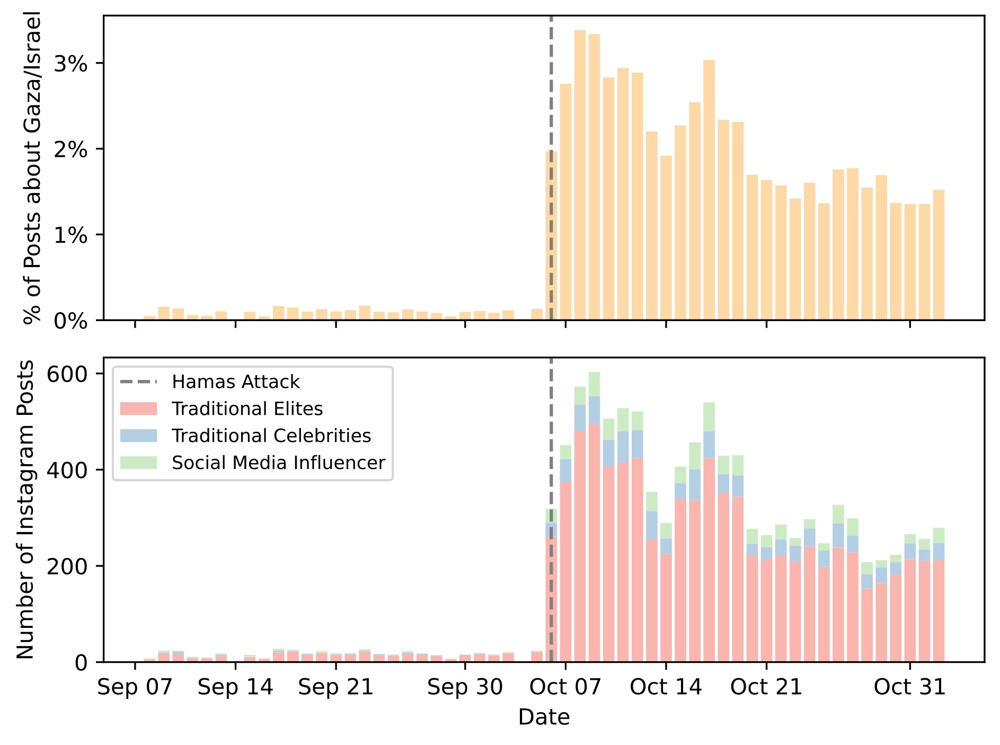
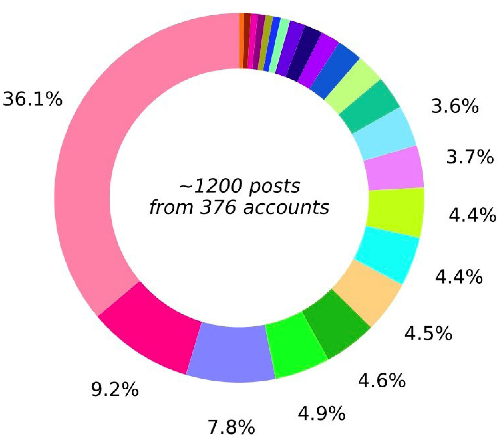
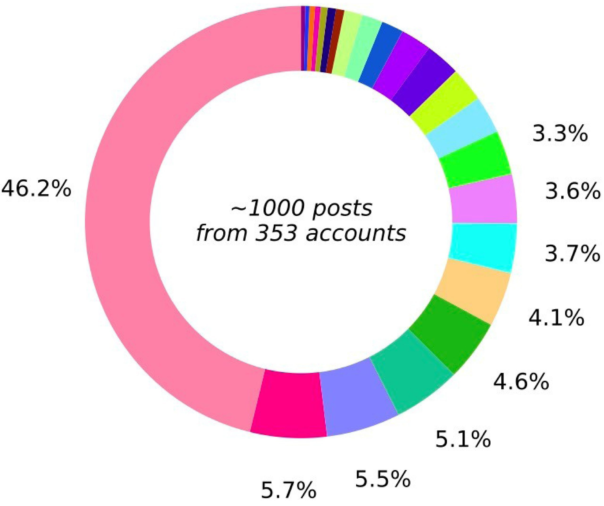
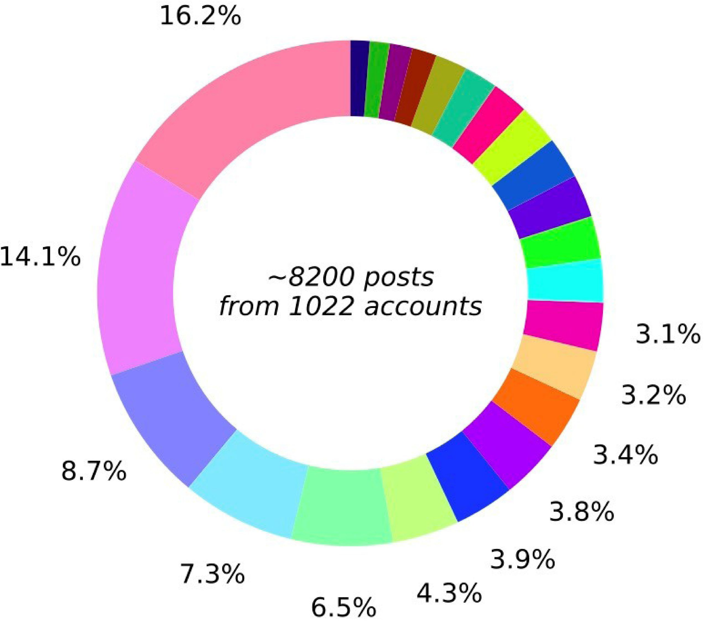
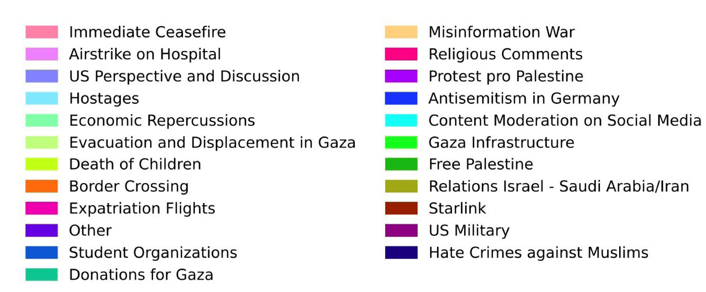
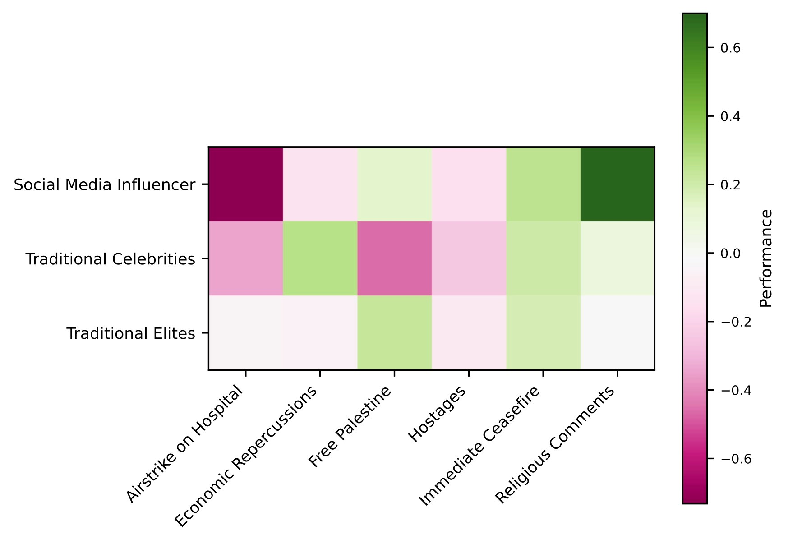

*This article was first published on [The Loop](https://theloop.ecpr.eu/instagram-influencers-shaping-discourse-on-the-israel-gaza-conflict/), the ECPR's political science blog, on 16 November 2023, and is republished here under its [CC BY-ND 4.0](https://creativecommons.org/licenses/by-nd/4.0/) licence, without the introductory paragraph and otherwise unchanged.*

The recent Israel-Gaza conflict, sparked by the unprecedented assault on Israel from the Gaza Strip on 7 October, has generated intense debate across political institutions, academic campuses, and civil society. Surprisingly, Instagram influencers, typically associated with fashion, fitness, and lifestyle content, have joined the discourse. The sudden politicisation of such previously apolitical figures raises fears that influencers may spread biased political agendas.

These concerns appear justified. Indeed, several influencers have recently exploited their sizeable platforms to champion specific causes. German influencer [Diana zur Löwen](https://taz.de/!171271), for instance, has been a vocal advocate for mental health awareness. And back in 2019, Swiss influencer [Anja Zeidler](https://www.instagram.com/p/B1fugbXIsR8/?hl=en) used Instagram to rally her 300,000 followers against the Mercosur free-trade agreement.

> Influencers cultivate 'parasocial relationships' with their followers which render their messages more impactful

There is compelling theoretical evidence supporting the capacity of influencers to shape political opinions and preferences. Influencers often boast tens of millions of followers, numbers that dwarf the circulation of a typical newspaper. But their influence is not merely the result of their platforms' vast reach; it isn't just about the numbers. Instead, influencers wield persuasive power by cultivating 'parasocial relationships' with their followers. On Instagram in particular, influencers foster trust, and create emotional connections, which render their messages more impactful, and ostensibly harmless.

This enhanced level of engagement cuts through far more effectively than traditional media. It positions influencers as trusted virtual confidants as opposed to remote elites. Consequently, when influencers like [Nora Achmaoui](https://www.instagram.com/noriyanori/) – who has amassed half a million followers on Instagram – pass comment on the current conflict, their messages carry significant weight, and resonate widely.

## Discourse shifts towards the war – a little

Analysis of posts created by Instagram accounts with more than 500,000 followers shows that content had indeed shifted towards the Israel-Palestine conflict, albeit only to a limited extent. Excluding transient posts, such as reels, in the week after 7 October, these accounts generated about 600 posts per day on the topic, accounting for approximately 3% of their total posting activity. This represents a noticeable, though not remarkable, amount of content focusing on the conflict.

### Evolution of Instagram posts on Gaza/Israel

Importantly, it is not influencers typically associated with Instagram who authored the bulk of these posts. Instead, those primarily responsible for the content were 'general elites', such as politicians, public institutions, and established media outlets.

Influencers, along with traditional celebrities like actors and athletes, contribute to only around 10% of Instagram content discussing the current situation in Israel. Yet, it may be exactly these accounts whose opinions people buy the most. Users perceive these accounts as messages from a relatable, trusted friend rather than pronouncements from a distant political elite.

> The Israel-Gaza content generated by traditional influencers wields a disproportionate effect because influencer accounts are more relatable and trusted than those of elites such as politicians

## Influencers call for ceasefires and prayers

A more detailed analysis of Instagram content addressing current events in Gaza reveals that influencers tend to focus on fewer aspects of the conflict than general elites. Influential accounts overwhelmingly call for an immediate ceasefire to alleviate the suffering of people in Gaza under Israeli attack.

General elites, by contrast, delve more deeply into various facets of the conflict. They discuss topics such as the alleged Israeli airstrike on the Al-Ahli Arab Hospital in Gaza, the US perspective on the conflict, and even the potential economic repercussions. Intriguingly, the only narrative that centres unequivocally on the suffering of Israelis pertains to the wellbeing and outlook of Israeli hostages.

### Evolution of Instagram posts on Israel-Gaza conflict

#### Traditional celebrities

#### Social media influencers

#### Traditional elites

#### Topics of relevant posts

Traditional celebrities and influencers, on the other hand, convey a more focused narrative. Nearly half the content posted by conventional influencers, such as fashion or fitness bloggers, calls for an immediate ceasefire to end human suffering. This is often accompanied by religious comments and prayers for the conflict's victims. By contrast, however, influencers display limited sympathy and concern for the Israeli hostages. Only 3% of comments address the conflict from this viewpoint.

## Pleas for peace perform better

Determining the motivations behind influencers' biased approach to the conflict, based on currently available data, is challenging. However, it is likely that economic considerations play a significant role. Unlike general elites, influencers must constantly maintain audience engagement. Decreased engagement translates into fewer views, slower growth in followers and, ultimately, to reduced ad revenue. Each post must therefore be crafted meticulously, to maximise impact.

### Engagement provoked by different topics

A deeper analysis of the performance of different aspects of the conflict, segmented by group, offers some insights. 'Performance' is the number of likes and comments a post generates. Values greater than one indicate better-than-average engagement for an account, and vice versa.

> Influencers risk losing engagement when posting about violence. Calls and prayers for peace are more successful, and this pushes the Instagram algorithms to encourage more such content

From this perspective, it becomes apparent that influencers risk losing engagement when posting about military violence or terrorist atrocities. Instead, calls and prayers for peace emerge as the more successful strategy. This dynamic sets up a positive feedback loop, or a vicious cycle, depending on one's viewpoint. Whether driven by individual choice or algorithmic influence, audiences on Instagram tend to engage more with the pro-Palestine, anti-war narrative. This prompts influencers to create content around these topics, and, subsequently, algorithms push such content to users' feeds, perpetuating the cycle.

## Why we must remain vigilant

Based on the data, it appears that influencers are indeed promoting a less than diverse discussion of the Israel-Palestine conflict. Yet on Instagram at least, the Israel-Palestine conflict discourse may already be subsiding. As a result, concerns about social media feeds being [overwhelmed with pro-Palestine content](https://www.economist.com/international/2023/11/02/israel-is-more-popular-than-social-media-posts-suggest) may soon dissipate.

However, this episode offers a crucial lesson: while political content from influencers may be infrequent, and fears of online misinformation potentially exaggerated, it is still essential to remain vigilant. Information from the right source can appear credible, especially when it comes not from a distant elite but, seemingly, from a close friend. Thus, it is crucial to approach such content with a discerning eye.
