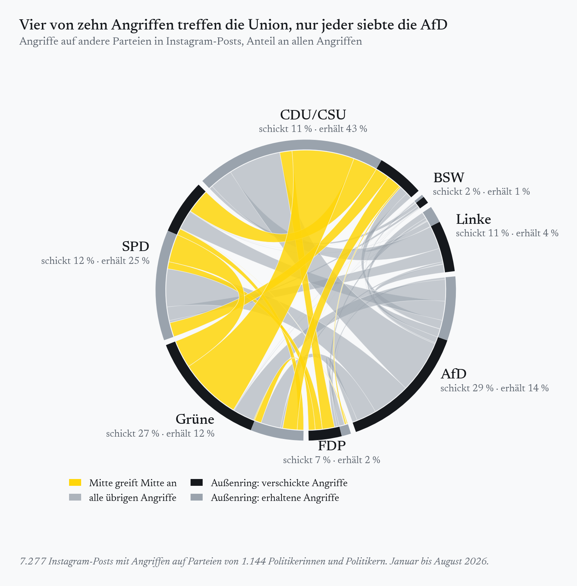

Ich bin im Ortsvorstand einer deutschen Partei aktiv. Eine Sache habe ich dabei nie wirklich verstanden: warum wir so viel Zeit damit verbringen, über andere zu reden, statt über uns selbst und unsere eigenen Ideen. Natürlich muss die Opposition die Regierung kritisieren, das ist ihre Aufgabe. Und natürlich belebt Konkurrenz das Geschäft. Wer um Stimmen wirbt, muss zeigen, warum er besser ist als die anderen. (Oder es zumindest glaubt.)

Nur ist die Vorstellung von Politik als Wettbewerb eben nur eine Sichtweise darauf, was Politik eigentlich ausmacht, und historisch ist sie nicht einmal die klassische. Politik als Markt, auf dem ausgehandelt wird, wer was wann und wie bekommt, wie es Harold Lasswell formuliert hat, ist die liberale Lesart. In der republikanischen Tradition von Aristoteles bis Rousseau ist Politik vor allem gemeinsame Sache, ein kooperatives Ringen um das Gemeinwohl. Jürgen Habermas hat diesen Gegensatz [später zugespitzt](https://doi.org/10.1111/j.1467-8675.1994.tb00001.x). Aber dazu mehr in einem späteren Post.

Selbst wenn man Politik als Wettbewerb versteht, bleibt die Frage, ob sich das ständige Reden über die anderen überhaupt lohnt. Die Forschung ist da ziemlich eindeutig: meistens nicht, und manchmal schadet es sogar. Trotzdem ist es allgegenwärtig. Man könnte es noch verstehen, wenn sich die Angriffe wenigstens gegen die Ränder richteten, die in den Umfragen inzwischen gemeinsam auf [fast 40 Prozent](https://www.wahlrecht.de/umfragen/) kommen. Wenn schon angreifen, dann doch die, die die demokratische Mitte insgesamt infrage stellen. Genau das passiert aber nicht. Ich habe mir angeschaut, wen deutsche Politikerinnen und Politiker auf Instagram angreifen: Vier von fünf Angriffen treffen eine Partei der Mitte, nur jeder siebte die AfD.

## Angriffe bringen Likes, keine Stimmen

Dass Angriffe so beliebt sind, hat einen einfachen Grund: Sie funktionieren im Feed. Wer über die Gegenseite schreibt, wird [deutlich häufiger geteilt](https://doi.org/10.1073/pnas.2024292118), und auch in meinen eigenen Instagram-Daten bekommen Angriffsposts mehr Likes und Kommentare als andere Posts derselben Politikerinnen und Politiker.

Nur: Ein Like ist keine Stimme, sondern höchstens ein Echo aus der eigenen Bubble. Wer die Forschung zu Negativkampagnen zusammenfasst, landet bei einem [ziemlich klaren Befund](https://doi.org/10.1111/j.1468-2508.2007.00618.x). Angriffe schaden dem Angegriffenen ein wenig, dem Angreifer aber meist mehr. Einen Beleg dafür, dass sich Negative Campaigning an der Wahlurne auszahlt, gibt es nicht.

Besonders schlecht sieht die Rechnung aus, wenn mehr als zwei Parteien antreten. In einem [Experiment bei einer italienischen Bürgermeisterwahl](https://doi.org/10.1111/ajps.12610) schadete negative Wahlwerbung vor allem dem, der sie verschickte. Der angegriffene Amtsinhaber blieb unbeschadet, gewonnen hat der dritte Kandidat, der sich herausgehalten hatte. Bei der Europawahl 2019 wandten sich vor allem jene Wählerinnen und Wähler vom Angreifer ab, die eine [gleich attraktive Alternative](https://doi.org/10.1080/10584609.2024.2314604) hatten. In einem Land mit je nach Lesart sechs bis sieben relevanten Parteien hat die fast jeder.

Und es gibt Nebenwirkungen. Je negativer Parteien miteinander umgehen, desto größer ist in einer [Studie über 16 Länder](https://doi.org/10.1016/j.electstud.2024.102745) die Abneigung ihrer Anhängerinnen und Anhänger gegeneinander. Die Forschung nennt das 'affektive Polarisierung'. Der Zusammenhang ist am stärksten bei jenen, deren Partei angreift oder angegriffen wird. Wer sich im Wahlkampf verbal zerlegt, erzieht seine Wählerschaft also zur Abneigung gegen genau die Partei, mit der man danach vielleicht regieren muss. Eine Gruppe profitiert dagegen von harten Kampagnen: [populistische Herausforderer](https://doi.org/10.1177/14651165211035675). Negativität ist ihr Terrain.

## Die Mitte wird von innen und außen angegriffen

Wie sieht das in Deutschland aus? Ich habe knapp 70.000 Instagram-Posts von gut 2.200 Politikerinnen und Politikern aus Bund, Ländern und Kommunen von Januar bis August 2026 ausgewertet und für jeden Post bestimmt, ob und welche andere Partei er angreift. Gut 7.000 Posts enthalten einen solchen Angriff. Das ist, ehrlich gesagt, weniger, als ich vermutet hätte.

So liest man die Grafik: Jede Partei hat einen Abschnitt auf dem Kreis, der dunkle Teil steht für die Angriffe, die sie verschickt, der helle für die, die sie abbekommt. Die Bänder verbinden Angreifer und Ziel, je breiter, desto mehr Angriffe, und gelb sind alle Angriffe, bei denen die Mitte die Mitte trifft. Etwa vier von zehn Angriffen treffen die Union, jeder vierte die SPD, gut jeder zehnte die Grünen. Die AfD, in den Umfragen [stärkste Kraft](https://www.wahlrecht.de/umfragen/), zieht nur jeden siebten Angriff auf sich.

Manches davon ist normal. Die Grünen, größte Oppositionspartei der Mitte, richten mehr als die Hälfte ihrer Angriffe gegen die Union, die größte Regierungspartei. Opposition heißt Kritik an der Regierung, und die [Forschung](https://doi.org/10.1057/s41253-019-00084-8) findet dieses Muster in vielen Ländern. Dass AfD und Linke fast ausschließlich die Mitte angreifen, ist ebenso wenig überraschend. Sie leben davon.

Bemerkenswert ist, wie wenig die Mitte zurückschießt. Die Union richtet knapp ein Fünftel ihrer Angriffe gegen die AfD, die Grünen ebenfalls. Nur die SPD arbeitet sich ernsthaft an ihr ab, mit gut einem Drittel ihrer Angriffe. Die FDP, deren liberale Grundwerte die AfD ebenfalls mit Füßen tritt, kommt auf lediglich sieben Prozent. Stattdessen greift sie zu vier Zehnteln die Union an und zu je gut einem Fünftel SPD und Grüne, also fast nur Parteien, mit denen sie irgendwann wieder regieren möchte.

Noch etwas fällt auf: Die FDP, ehemals die Lieblingszielscheibe der Linken, steht kaum mehr im Kreuzfeuer. Nur zwei Prozent aller Angriffe gelten ihr. Wahrscheinlich wird sie schon jetzt nicht mehr als ernsthafter Gegner angesehen. Dabei beeinflusst schon die bloße Sichtbarkeit einer Partei, wie Menschen wählen, das zeigt die [Forschung zur Wahlkampfberichterstattung](https://doi.org/10.1080/10584609.2010.516798). Kritik mag zwar unangenehm sein. Ignoriert zu werden ist ungleich schlimmer.

## Die Mitte als gemeinsamer Gegner der Ränder

Man kann einwenden, dass Demokratie vom Streit lebt und eine Opposition, die nicht kritisiert, ihren Job verfehlt. Das stimmt. Dass die Parteien der Mitte einander kritisieren, ist auch nicht mein Punkt. Das Problem ist das Verhältnis. Die Mitte wird von den Rändern angegriffen, und sie greift sich zusätzlich selbst an. Am Ende kommen vier von fünf Angriffen bei ihr an.

Die Forschung ist hier deutlich. Wenn zwei sich streiten, gewinnt der Dritte, und die Parteien, denen harte Kampagnen tatsächlich nützen, stehen nicht in der Mitte. Wer die Ränder zurückdrängen will, erreicht das nicht, indem er vor allem den Nachbarn schlechtmacht, mit dem er dieses Ziel eigentlich teilt. Es bräuchte eine demokratische Mitte, die ihre Unterschiede austrägt, ohne sich gegenseitig zu zerlegen, und die ihre Angriffe auf die richtet, die diese Mitte insgesamt infrage stellen. Solange sie das nicht tut, wird sie von allen Seiten aufgefressen und zersetzt sich gleichzeitig selbst.

---

*Methode: Grundlage sind Instagram-Posts von Personen, die in Wikidata als deutsche Politikerinnen und Politiker geführt sind (2.222 Personen aus Bund, Ländern und Kommunen; Mitglieder des Europäischen Parlaments ausgeschlossen), veröffentlicht zwischen Januar und August 2026, höchstens 40 zufällig ausgewählte Posts pro Account, N = 68.594. Ein Sprachmodell hat Caption und Videotranskript jedes Posts auf Angriffe und Angriffsziele automatisiert kodiert. Kritik an „der Bundesregierung“ zählt als Angriff auf Union und SPD. Posts mit mehreren Zielen werden anteilig gezählt. Angriffe auf die eigene Partei und auf Kleinparteien sind nicht in der Grafik enthalten.*
