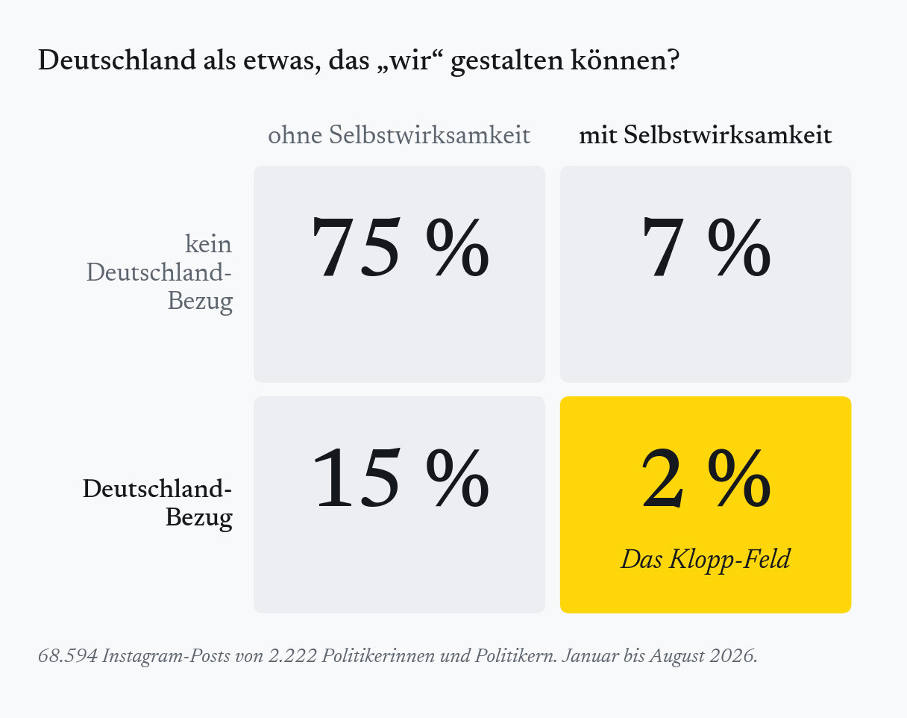
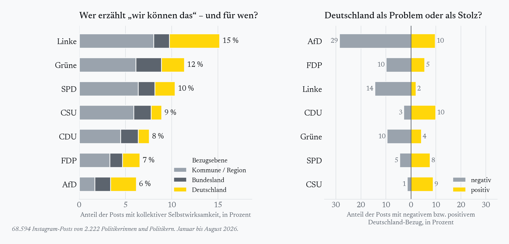
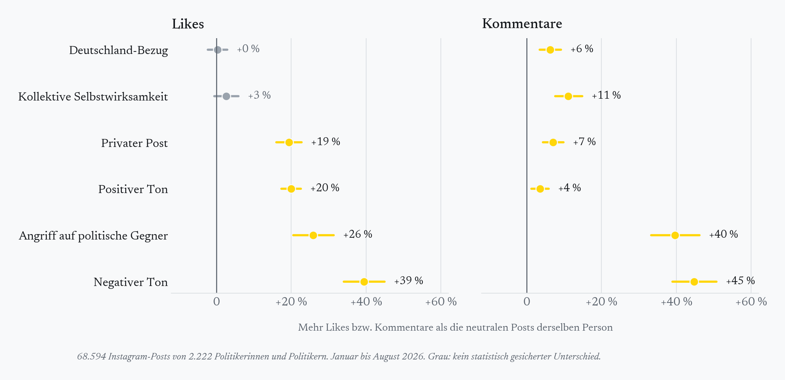

Am 17. September nutzte Jürgen Klopp seine erste Kadernominierung als Bundestrainer für eine [Grundsatzrede](https://www.stuttgarter-zeitung.de/sport/sport-mix/positiver-patriotismus-grundsatzrede-gegen-rechts-klopp-will-sich-fahne-zurueckholen-79477644.html): Er wolle sich „die Fahne zurückholen“ und von „positivem Patriotismus“ sprechen, stolz und trotzdem „offen und vielfältig und nett“. Die Reaktionen waren groß. Aus der Politik kamen sie auffällig selten.

Dabei zeigt ein Blick in die Niederlande, dass sich mit genau diesem Ton Wahlen gewinnen lassen. Rob Jetten hat D66 im Oktober 2025 mit dem Slogan „Het kan wél“ – es geht doch – auf [26 Sitze](https://www.pbs.org/newshour/amp/world/tight-dutch-election-finishes-with-tie-between-wilders-far-right-party-and-centrist-d66) und Platz eins geführt, gleichauf mit der PVV von Geert Wilders. Seine Kampagne, angelehnt an Obamas „Yes we can“, erzählte Zukunft als etwas Machbares ([Freitag](https://www.freitag.de/autoren/tobias-mueller/niederlande-wahlsieger-rob-jetten-hielt-es-mit-obamas-slogan-yes-we-can)). Die Forschung nennt das ‚kollektive Selbstwirksamkeit‘: die Überzeugung, dass eine Gemeinschaft ihre Lage gemeinsam verändern kann ([Bandura 2000](https://doi.org/10.1111/1467-8721.00064)). Klopps positiver Patriotismus ist die nationale Variante davon.

Ich habe mir angesehen, wie oft deutsche Politikerinnen und Politiker diesen Ton anschlagen, und zwar in knapp 69.000 Instagram-Posts aus diesem Jahr. Das Ergebnis ist ernüchternd.

## Selbstwirksamkeit ist selten – und meistens lokal

Nur etwa jeder elfte Post erzählt, dass „wir“ etwas bewegen können. Und wenn, dann geht es fast nie um Deutschland: Drei von vier dieser Posts handeln von der eigenen Stadt, der eigenen Gemeinde oder dem eigenen Bundesland. „Wir können das“ ist in der deutschen Politikkommunikation ein Satz über den Wahlkreis, nicht über das Land. Posts, die Deutschland als etwas beschreiben, das wir gemeinsam gestalten können, machen gerade einmal 2 Prozent aus. Das Feld, das Klopp füllen will, ist fast leer.

Ausgerechnet die beiden Parteien, die sich als Anwälte des Aufbruchs beziehungsweise der Nation verstehen, erzählen am seltensten, dass ein Kollektiv etwas bewegen kann: Bei der FDP sind es 7, bei der AfD 6 Prozent der Posts. Am häufigsten tut es die Linke mit 15 Prozent, gefolgt von Grünen und SPD mit 11 und 10 Prozent; CDU und CSU liegen mit 8 und 9 Prozent dazwischen.

## Aufbruch vor Ort, Abstieg im Land

Das heißt nicht, dass Deutschland im Feed fehlt. Jeder sechste Post spricht über das Land als Ganzes. Nur hängt der Ton davon ab, wer gerade regiert. Bei CDU und CSU ist Deutschland in zwei von drei Fällen eine Geschichte von Stolz und Erfolg, bei der SPD in gut der Hälfte. In der Opposition kippt das Bild: Dort sind 68 Prozent der Deutschland-Posts negativ, bei den Regierungsparteien 22 Prozent. Bei der AfD, die mit Abstand am häufigsten über Deutschland spricht, sind es 70 Prozent, bei der Linken 84, bei den Grünen 62 und bei der FDP 57 Prozent.

Das ist die eigentliche Pointe hinter Klopps Rede. Die Opposition ist nicht grundsätzlich mutlos: Grüne und Linke erzählen vor Ort sogar häufiger als alle anderen, dass sich etwas bewegen lässt. Sobald es aber um das Land geht, erzählen genau die Parteien, die den Aufbruch verkörpern könnten, Deutschland als Problem. Die Regierungsparteien wiederum erzählen es positiv, aber als Bilanz, nicht als Einladung. Ein positiver Patriotismus im Sinne Klopps, stolz, offen und auf die Zukunft gerichtet, hat auf Instagram keinen Absender.

## Empörung zieht mehr als Zuversicht

Man könnte einwenden, dass die Politik hier schlicht ihrem Publikum folgt. Das lässt sich prüfen, indem man die Posts jeder Person untereinander vergleicht: Wie schneidet ein negativer Post im Vergleich zu einem neutralen derselben Politikerin ab? Reichweite, Bekanntheit und Partei spielen bei diesem Vergleich keine Rolle.

Die Antwort ist eindeutig, und sie ist für Klopps Anliegen unbequem. Negative Posts bekommen rund 40 Prozent mehr Likes als neutrale, Angriffe auf politische Gegner rund 25 Prozent mehr. Bei den Kommentaren ist der Abstand noch größer. Positive Posts liegen mit etwa 20 Prozent mehr Likes ebenfalls über neutralen, aber klar hinter negativen. Emotion schlägt Sachlichkeit, und Empörung schlägt Zuversicht. Das deckt sich mit dem, was wir aus der Forschung wissen: Angriffe auf die Gegenseite treiben die Verbreitung von Posts stärker als fast alles andere ([Rathje, Van Bavel und van der Linden 2021](https://doi.org/10.1073/pnas.2024292118); [Brady et al. 2017](https://doi.org/10.1073/pnas.1618923114)), und emotionale Posts, positive wie negative, erzeugen mehr Reaktionen als nüchterne ([Klüser 2025](https://doi.org/10.1080/10584609.2025.2498526)).

## Das Narrativ macht den Unterschied

Dass Empörung besser zieht, liegt weniger an den Politikerinnen und Politikern als an der Logik der Plattformen. Instagram, TikTok und Co. belohnen, was Aufmerksamkeit bindet, und Negativität tut das besonders zuverlässig. Algorithmen, die auf Engagement optimiert sind, verstärken deshalb spaltende und empörte Inhalte ([Milli et al. 2025](https://doi.org/10.1093/pnasnexus/pgaf062)). Wer auf diesen Plattformen spontan und Post für Post kommuniziert, landet fast zwangsläufig bei der Empörung.

Aufmerksamkeit lässt sich aber auch anders erzeugen. Ein positives Narrativ, das Menschen mitreißt, kann ebenso viel davon auf sich ziehen, wenn es konsequent erzählt wird. Das hat Barack Obama 2008 mit [„Yes we can“](https://www.livingroomcandidate.org/commercials/2008/yes-we-can-web) gezeigt, Emmanuel Macron 2017 mit einem Wahlkampf, der Frankreich [„wieder positiv denken“](https://time.com/4823290/emmanuel-macron-france-parliament-protests-optimism/) ließ, und Zohran Mamdani 2025 in New York mit dem Versprechen einer [bezahlbaren Stadt](https://www.cbsnews.com/newyork/news/mamdani-wins-nyc-mayoral-election-2025/). In Großbritannien ist Andy Burnham im Juli mit dem Anspruch ins Amt gekommen, [„die Hoffnung zurückzubringen“](https://abcnews.com/International/andy-burnham-become-uks-prime-minister-after-meeting/story?id=134907835). Und in den Niederlanden hat Jetten es vorgemacht. Keiner von ihnen hat nur gelegentlich einen optimistischen Post abgesetzt. Bei allen war Zuversicht das Programm.

Auch die Daten deuten in diese Richtung. Bei Politikerinnen und Politikern der Opposition, also dort, woher auch Jetten kam, bringen Posts mit kollektiver Selbstwirksamkeit rund 8 Prozent mehr Likes als ihre übrigen Posts. Der Effekt ist klein, und ein Like ist keine Wählerstimme. Wer einer Politikerin auf Instagram folgt, ist meist schon auf ihrer Seite. Aber es zeigt: Zuversicht wird nicht bestraft.

Klopp hat mit seiner Rede eine Lücke benannt, die die Daten bestätigen. Füllen wird sie niemand mit einzelnen Fahnen und einzelnen Posts. Füllen wird sie nur, wer den Mut hat, ein übergreifendes Narrativ zu erzählen: dass dieses Land etwas kann, wenn wir es wollen.

---

*Methode: Grundlage sind Instagram-Posts von Personen, die in Wikidata als deutsche Politikerinnen und Politiker geführt sind (2.222 Personen aus Bund, Ländern und Kommunen; Mitglieder des Europäischen Parlaments ausgeschlossen), veröffentlicht zwischen Januar und August 2026, höchstens 40 zufällig ausgewählte Posts pro Account, N = 68.594. Ein Sprachmodell hat Caption und Videotranskript jedes Posts nach Tonfall, Angriffen auf politische Gegner, kollektiver Selbstwirksamkeit und Deutschland-Bezug kodiert; die Kodierung wurde an Grenzfällen von Hand geprüft. Die Engagement-Vergleiche berücksichtigen Unterschiede zwischen Personen und Monaten sowie Format, Textlänge und Alter der Posts. Code und aggregierte Daten auf Anfrage.*

